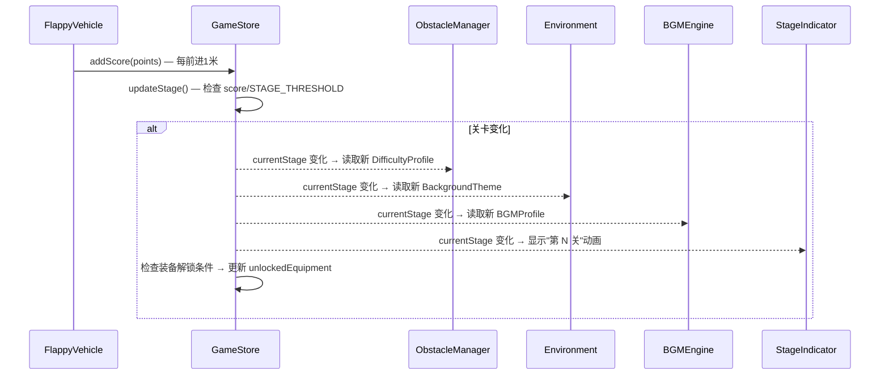

# 技术设计文档：关卡系统（Level System）

## 概述

关卡系统为飞行建造游戏引入阶段性挑战机制。核心思路是：以飞行距离（score）为驱动，每 1000 米进入新关卡，关卡推进时动态调整障碍物难度参数、切换环境视觉主题、切换背景音乐风格，并在特定关卡解锁装备奖励。

系统设计遵循"配置驱动"原则——所有关卡参数集中定义在 `LEVEL_CONFIG` 常量中，组件通过读取 Game Store 中的 `currentStage` 来响应关卡变化，无需修改组件逻辑即可调整难度曲线和主题配置。

### 关键设计决策

1. **距离即分数**：现有 `score` 字段已按 1 米 = 1 分计算（`FlappyVehicle` 中每前进 1 米加 1 分），直接复用 `score` 作为飞行距离，无需新增距离字段
2. **配置驱动**：关卡 1-5 使用预设值，关卡 6+ 使用公式计算，所有参数集中在 `LEVEL_CONFIG`
3. **响应式架构**：各组件通过 Zustand selector 订阅 `currentStage`，关卡变化自动触发 UI/环境/音乐更新
4. **渐进解锁**：装备解锁与关卡绑定，建造模式仅展示已解锁零件，激励玩家挑战更高关卡

## 架构

### 系统架构图

```mermaid
graph TB
    subgraph "状态层 (Zustand Store)"
        GS[useGameStore]
        GS --> CS[currentStage]
        GS --> HS[highestStage]
        GS --> UE[unlockedEquipment]
        GS --> SC[score / 飞行距离]
    end

    subgraph "配置层 (Constants)"
        LC[LEVEL_CONFIG]
        LC --> DP[Difficulty Profiles]
        LC --> BT[Background Themes]
        LC --> BP[BGM Profiles]
        LC --> UT[Unlock Table]
    end

    subgraph "计算层 (Pure Functions)"
        CDF[getCurrentDifficultyProfile]
        CBT[getCurrentBackgroundTheme]
        CBP[getCurrentBGMProfile]
        CST[computeStage]
    end

    subgraph "渲染层 (React Components)"
        FS[FlightSystem] -->|vehicleX → score| GS
        OM[ObstacleManager] -->|读取 difficulty| CDF
        ENV[Environment] -->|读取 theme| CBT
        BGM[BGMEngine] -->|读取 bgm profile| CBP
        SI[StageIndicator] -->|显示关卡| CS
        BS[BuildingSystem] -->|过滤已解锁零件| UE
        GOM[GameOverModal] -->|显示关卡信息| CS
    end

    SC -->|Math.floor(score/1000)+1| CST
    CST --> CS
    CS --> CDF
    CS --> CBT
    CS --> CBP
    LC --> CDF
    LC --> CBT
    LC --> CBP
```

### 数据流




## 组件与接口

### 1. 配置层：LEVEL_CONFIG（gameConstants.js）

所有关卡参数集中定义在 `gameConstants.js` 的 `LEVEL_CONFIG` 常量中。

```javascript
export const LEVEL_CONFIG = {
  STAGE_THRESHOLD: 1000, // 每 1000 米一个关卡

  // 关卡 1-5 难度预设
  DIFFICULTY_PROFILES: {
    1: { gapSize: { normal: 10, vip: 18 }, spacing: 15, gapYRange: [8, 25] },
    2: { gapSize: { normal: 9, vip: 16 }, spacing: 13, gapYRange: [7, 25] },
    3: { gapSize: { normal: 8, vip: 14 }, spacing: 11, gapYRange: [6, 26] },
    4: { gapSize: { normal: 7, vip: 12 }, spacing: 9,  gapYRange: [5, 27] },
    5: { gapSize: { normal: 6, vip: 11 }, spacing: 8,  gapYRange: [5, 28] },
  },

  // 难度下限
  MIN_GAP_SIZE_NORMAL: 5,
  MIN_GAP_SIZE_VIP: 10,
  MIN_SPACING: 8,

  // 关卡 6+ 难度公式参数
  GAP_REDUCTION_RATE: 0.05,   // 每关缝隙缩小比例
  SPACING_REDUCTION: 0.5,     // 每关间距减少值

  // 关卡 1-5 障碍物颜色方案
  OBSTACLE_COLOR_THEMES: {
    1: { top: '#16a34a', bottom: '#15803d' }, // 翠绿
    2: { top: '#ea580c', bottom: '#c2410c' }, // 橙红
    3: { top: '#7c3aed', bottom: '#6d28d9' }, // 紫色
    4: { top: '#0891b2', bottom: '#0e7490' }, // 青色
    5: { top: '#dc2626', bottom: '#b91c1c' }, // 深红
  },

  // 关卡 1-5 背景主题
  BACKGROUND_THEMES: {
    1: { // 晴天白昼
      sky: { sunPosition: [100, 20, 100], inclination: 0.5, azimuth: 0.25 },
      ambientIntensity: 0.4,
      directionalIntensity: 1.0,
      stars: { count: 0, fade: false, speed: 0 },
    },
    2: { // 黄昏暮色
      sky: { sunPosition: [100, 5, 100], inclination: 0.49, azimuth: 0.15 },
      ambientIntensity: 0.3,
      directionalIntensity: 0.7,
      stars: { count: 500, fade: true, speed: 0.5 },
    },
    3: { // 星空夜晚
      sky: { sunPosition: [100, -10, 100], inclination: 0.48, azimuth: 0.05 },
      ambientIntensity: 0.15,
      directionalIntensity: 0.3,
      stars: { count: 3000, fade: true, speed: 1.5 },
    },
    4: { // 极光黎明
      sky: { sunPosition: [100, 2, 100], inclination: 0.52, azimuth: 0.35 },
      ambientIntensity: 0.35,
      directionalIntensity: 0.6,
      stars: { count: 1500, fade: true, speed: 2.0 },
    },
    5: { // 烈日荒漠
      sky: { sunPosition: [100, 40, 100], inclination: 0.55, azimuth: 0.25 },
      ambientIntensity: 0.6,
      directionalIntensity: 1.5,
      stars: { count: 0, fade: false, speed: 0 },
    },
  },

  // 关卡 1-5 BGM 配置
  STAGE_BGM_PROFILES: {
    1: { // 晴天白昼 — 明亮轻快
      chords: [[329.6, 392.0, 493.9], [261.6, 329.6, 392.0], [196.0, 246.9, 293.7], [293.7, 370.0, 440.0]],
      bassNotes: [164.8, 130.8, 98.0, 146.8],
      melody: [659.3, 0, 784.0, 659.3, 587.3, 0, 523.3, 587.3, 659.3, 0, 784.0, 880.0, 784.0, 0, 659.3, 0],
      chordDur: 2.8,
      oscType: 'triangle',
      melodyOscType: 'sine',
    },
    2: { // 黄昏暮色 — 温暖舒缓
      chords: [[261.6, 329.6, 392.0], [220.0, 277.2, 329.6], [196.0, 246.9, 293.7], [246.9, 311.1, 370.0]],
      bassNotes: [130.8, 110.0, 98.0, 123.5],
      melody: [523.3, 0, 493.9, 440.0, 392.0, 0, 440.0, 493.9, 523.3, 0, 587.3, 523.3, 493.9, 0, 440.0, 0],
      chordDur: 3.5,
      oscType: 'sine',
      melodyOscType: 'sine',
    },
    3: { // 星空夜晚 — 空灵悠远
      chords: [[293.7, 370.0, 440.0], [261.6, 329.6, 415.3], [220.0, 293.7, 370.0], [246.9, 329.6, 392.0]],
      bassNotes: [146.8, 130.8, 110.0, 123.5],
      melody: [880.0, 0, 784.0, 0, 659.3, 0, 587.3, 0, 659.3, 0, 784.0, 0, 880.0, 0, 0, 0],
      chordDur: 4.0,
      oscType: 'sine',
      melodyOscType: 'triangle',
    },
    4: { // 极光黎明 — 神秘渐亮
      chords: [[246.9, 311.1, 392.0], [277.2, 349.2, 440.0], [293.7, 370.0, 466.2], [329.6, 415.3, 523.3]],
      bassNotes: [123.5, 138.6, 146.8, 164.8],
      melody: [493.9, 523.3, 587.3, 659.3, 0, 784.0, 880.0, 0, 987.8, 880.0, 784.0, 0, 659.3, 587.3, 523.3, 0],
      chordDur: 3.2,
      oscType: 'triangle',
      melodyOscType: 'sine',
    },
    5: { // 烈日荒漠 — 紧张急促
      chords: [[329.6, 415.3, 493.9], [349.2, 440.0, 523.3], [293.7, 370.0, 440.0], [311.1, 392.0, 466.2]],
      bassNotes: [164.8, 174.6, 146.8, 155.6],
      melody: [659.3, 784.0, 659.3, 784.0, 880.0, 784.0, 659.3, 784.0, 880.0, 987.8, 880.0, 784.0, 659.3, 784.0, 659.3, 0],
      chordDur: 2.0,
      oscType: 'sawtooth',
      melodyOscType: 'square',
    },
  },

  // 装备解锁表
  EQUIPMENT_UNLOCKS: {
    1: [{ type: 'Wing', tier: 'normal' }, { type: 'Engine', tier: 'normal' }, { type: 'Fuselage', tier: 'normal' }, { type: 'Cockpit', tier: 'normal' }],
    3: [{ type: 'Wing', tier: 'vip' }],
    5: [{ type: 'Engine', tier: 'vip' }],
    7: [{ type: 'Fuselage', tier: 'vip' }],
    10: [{ type: 'Cockpit', tier: 'vip' }],
  },

  // 过渡动画时长
  COLOR_TRANSITION_DURATION: 0.5,    // 障碍物颜色过渡（秒）
  BG_TRANSITION_DURATION: 1.0,       // 背景主题过渡（秒）
  BGM_FADEOUT_DURATION: 1.5,         // BGM 淡出（秒）
  BGM_FADEIN_DURATION: 2.0,          // BGM 淡入（秒）
  STAGE_INDICATOR_DURATION: 2000,    // 关卡提示显示时长（毫秒）
};
```

### 2. 状态层：useGameStore 扩展

在现有 Zustand store 中新增关卡相关状态和方法：

```javascript
// 新增状态字段
currentStage: 1,                    // 当前关卡阶段
highestStage: 1,                    // 历史最高关卡（持久化）
unlockedEquipment: [                // 已解锁装备列表（持久化）
  { type: 'Wing', tier: 'normal' },
  { type: 'Engine', tier: 'normal' },
  { type: 'Fuselage', tier: 'normal' },
  { type: 'Cockpit', tier: 'normal' },
],
stageJustChanged: false,            // 关卡刚刚变化标记（用于触发动画）

// 新增方法
updateStage: () => void             // 根据 score 计算并更新 currentStage
getCurrentDifficultyProfile: () => DifficultyProfile  // 获取当前难度配置
getCurrentBackgroundTheme: () => BackgroundTheme       // 获取当前背景主题
getCurrentBGMProfile: () => BGMProfile                 // 获取当前 BGM 配置
isEquipmentUnlocked: (type, tier) => boolean           // 检查装备是否已解锁
```

**关卡计算公式**：
```javascript
const computeStage = (score) => Math.floor(score / LEVEL_CONFIG.STAGE_THRESHOLD) + 1;
```

**关卡 6+ 难度公式**：
```javascript
const computeDifficultyProfile = (stage, isVIP) => {
  if (stage <= 5) return LEVEL_CONFIG.DIFFICULTY_PROFILES[stage];
  const base = LEVEL_CONFIG.DIFFICULTY_PROFILES[5];
  const extraStages = stage - 5;
  const gapNormal = Math.max(
    LEVEL_CONFIG.MIN_GAP_SIZE_NORMAL,
    base.gapSize.normal * (1 - LEVEL_CONFIG.GAP_REDUCTION_RATE * extraStages)
  );
  const gapVip = Math.max(
    LEVEL_CONFIG.MIN_GAP_SIZE_VIP,
    base.gapSize.vip * (1 - LEVEL_CONFIG.GAP_REDUCTION_RATE * extraStages)
  );
  const spacing = Math.max(
    LEVEL_CONFIG.MIN_SPACING,
    base.spacing - LEVEL_CONFIG.SPACING_REDUCTION * extraStages
  );
  return { gapSize: { normal: gapNormal, vip: gapVip }, spacing, gapYRange: base.gapYRange };
};
```

**持久化扩展**：在 `persist` 的 `partialize` 中新增 `highestStage` 和 `unlockedEquipment`。

### 3. ObstacleManager 改造

当前 `ObstacleManager` 使用固定的 `OBSTACLE_SPACING` 和 `GAP_SIZE`。改造后：

- 通过 `useGameStore` 订阅 `currentStage`
- 调用 `getCurrentDifficultyProfile()` 获取当前关卡的 `gapSize`、`spacing`、`gapYRange`
- 新生成的障碍物使用当前关卡的难度参数
- 已生成的障碍物保持原参数不变（避免突变）
- 从 `LEVEL_CONFIG.OBSTACLE_COLOR_THEMES` 读取当前关卡的颜色方案

**接口变化**：
```javascript
// ObstaclePair 新增 colorTheme prop
<ObstaclePair id={id} x={x} gapY={gapY} gapSize={gapSize} colorTheme={colorTheme} />
```

### 4. Environment 改造

当前 `Environment` 使用硬编码的 Sky/Stars/Light 参数。改造后：

- 订阅 `currentStage`，读取 `getCurrentBackgroundTheme()`
- 使用 `useFrame` + `THREE.MathUtils.lerp` 在帧循环中平滑插值天空、光照、星星参数
- 过渡时长由 `LEVEL_CONFIG.BG_TRANSITION_DURATION` 控制

**接口**：组件内部状态管理，无外部接口变化。

### 5. BGMEngine 改造

当前 `_playFlight()` 使用硬编码的音乐参数。改造后：

- 新增 `switchStage(stage)` 方法
- 从 `LEVEL_CONFIG.STAGE_BGM_PROFILES` 读取当前关卡的音乐参数
- 关卡切换时：先淡出当前音乐（1.5s），再用新参数淡入（2s）
- 建造模式和欢迎页音乐不受影响
- Web Audio API 不可用时静默降级

**useBGM hook 扩展**：
```javascript
// 新增 currentStage 订阅
const currentStage = useGameStore((s) => s.currentStage);
useEffect(() => {
  if (gameMode === GAME_MODES.FLIGHT_MODE && !isGameOver) {
    bgmEngine.switchStage(currentStage);
  }
}, [currentStage, gameMode, isGameOver]);
```

### 6. StageIndicator 组件（新增）

新增 React 组件，负责关卡切换时的视觉反馈：

- **中央提示**：关卡变化时在屏幕中央显示"第 N 关"/"Stage N"，2 秒后淡出
- **HUD 常驻显示**：飞行模式下在 HUD 区域持续显示当前关卡编号
- 使用 CSS 动画实现淡入淡出效果
- 通过 `useI18n` 支持中英文

```javascript
// StageIndicator.jsx
function StageIndicator() {
  const currentStage = useGameStore(s => s.currentStage);
  const stageJustChanged = useGameStore(s => s.stageJustChanged);
  const gameMode = useGameStore(s => s.gameMode);
  const { t } = useI18n();
  // ... 渲染逻辑
}
```

### 7. BuildingSystem / Toolbar 改造

- `Toolbar` 根据 `unlockedEquipment` 过滤可选零件，未解锁的零件显示锁定状态和解锁条件
- `BuildingSystem.addPart` 增加解锁检查，阻止放置未解锁零件
- VIP 零件的解锁同时需要 VIP 身份和关卡解锁两个条件

### 8. GameOverModal 改造

- 显示本次到达的最高关卡（`currentStage`）
- 显示历史最高关卡（`highestStage`）
- 新增 i18n 键：`stageReached`、`highestStage` 等


## 数据模型

### 核心类型定义

```typescript
// 难度配置
interface DifficultyProfile {
  gapSize: { normal: number; vip: number };  // 缝隙大小（米）
  spacing: number;                            // 障碍物间距（米）
  gapYRange: [number, number];               // 缝隙 Y 轴范围 [min, max]
}

// 背景主题
interface BackgroundTheme {
  sky: {
    sunPosition: [number, number, number];
    inclination: number;
    azimuth: number;
  };
  ambientIntensity: number;
  directionalIntensity: number;
  stars: {
    count: number;
    fade: boolean;
    speed: number;
  };
}

// BGM 配置
interface StageBGMProfile {
  chords: number[][];          // 和弦频率数组
  bassNotes: number[];         // 低音音符频率
  melody: number[];            // 旋律音符频率（0 = 休止）
  chordDur: number;            // 和弦持续时间（秒）
  oscType: OscillatorType;     // 和弦振荡器类型
  melodyOscType: OscillatorType; // 旋律振荡器类型
}

// 障碍物颜色主题
interface ObstacleColorTheme {
  top: string;    // 上方管子颜色
  bottom: string; // 下方管子颜色
}

// 装备解锁项
interface EquipmentUnlock {
  type: string;   // PART_TYPES 中的值
  tier: string;   // PART_TIERS 中的值
}

// 关卡总配置
interface LevelConfig {
  STAGE_THRESHOLD: number;
  DIFFICULTY_PROFILES: Record<number, DifficultyProfile>;
  MIN_GAP_SIZE_NORMAL: number;
  MIN_GAP_SIZE_VIP: number;
  MIN_SPACING: number;
  GAP_REDUCTION_RATE: number;
  SPACING_REDUCTION: number;
  OBSTACLE_COLOR_THEMES: Record<number, ObstacleColorTheme>;
  BACKGROUND_THEMES: Record<number, BackgroundTheme>;
  STAGE_BGM_PROFILES: Record<number, StageBGMProfile>;
  EQUIPMENT_UNLOCKS: Record<number, EquipmentUnlock[]>;
  COLOR_TRANSITION_DURATION: number;
  BG_TRANSITION_DURATION: number;
  BGM_FADEOUT_DURATION: number;
  BGM_FADEIN_DURATION: number;
  STAGE_INDICATOR_DURATION: number;
}
```

### Store 状态扩展

```typescript
// useGameStore 新增字段
interface LevelState {
  currentStage: number;           // 当前关卡，默认 1
  highestStage: number;           // 历史最高关卡，持久化
  unlockedEquipment: EquipmentUnlock[];  // 已解锁装备，持久化
  stageJustChanged: boolean;      // 关卡刚变化标记

  // 方法
  updateStage: () => void;
  getCurrentDifficultyProfile: () => DifficultyProfile;
  getCurrentBackgroundTheme: () => BackgroundTheme;
  getCurrentBGMProfile: () => StageBGMProfile;
  isEquipmentUnlocked: (type: string, tier: string) => boolean;
  clearStageChanged: () => void;
}
```

### 持久化策略

在 `persist` 中间件的 `partialize` 中新增：

```javascript
partialize: (state) => ({
  // ... 现有字段
  highestStage: state.highestStage,
  unlockedEquipment: state.unlockedEquipment,
}),
```

`currentStage` 不持久化（每次飞行从 1 开始）。`stageJustChanged` 不持久化（瞬态 UI 标记）。


## 正确性属性（Correctness Properties）

*属性（Property）是指在系统所有合法执行中都应成立的特征或行为——本质上是对系统应做什么的形式化陈述。属性是人类可读规格说明与机器可验证正确性保证之间的桥梁。*

### Property 1: 关卡阶段计算正确性

*For any* 非负整数 score 和 STAGE_THRESHOLD = 1000，`computeStage(score)` 应返回 `Math.floor(score / 1000) + 1`。特别地，score 在 [0, 999] 时返回 1，score 在 [1000, 1999] 时返回 2，以此类推。

**Validates: Requirements 1.1, 1.2, 1.3**

### Property 2: 游戏重置时关卡归一

*For any* currentStage 值，当调用 `resetGame()` 或 `toggleGameMode()`（从飞行切换到建造）后，`currentStage` 应等于 1。

**Validates: Requirements 1.4, 3.4**

### Property 3: 续命保留关卡

*For any* currentStage 值 N，当调用 `shareRevive()` 或 `referralRevive()` 后，`currentStage` 应仍等于 N。

**Validates: Requirements 1.5**

### Property 4: 难度配置完整性

*For any* 正整数 stage，`getCurrentDifficultyProfile(stage)` 返回的对象应包含 `gapSize`（含 `normal` 和 `vip` 子字段）、`spacing`（正数）和 `gapYRange`（长度为 2 的数组且 min < max）。对于 stage 1-5，返回值应与 `LEVEL_CONFIG.DIFFICULTY_PROFILES[stage]` 完全一致。

**Validates: Requirements 2.1, 2.2, 2.6, 3.5**

### Property 5: 难度单调递增且有下限

*For any* 两个正整数 stage1 < stage2：
- `getDifficultyProfile(stage2).gapSize.normal <= getDifficultyProfile(stage1).gapSize.normal`
- `getDifficultyProfile(stage2).gapSize.vip <= getDifficultyProfile(stage1).gapSize.vip`
- `getDifficultyProfile(stage2).spacing <= getDifficultyProfile(stage1).spacing`
- `getDifficultyProfile(stage).gapSize.normal >= MIN_GAP_SIZE_NORMAL (5)` 对所有 stage 成立
- `getDifficultyProfile(stage).gapSize.vip >= MIN_GAP_SIZE_VIP (10)` 对所有 stage 成立
- `getDifficultyProfile(stage).spacing >= MIN_SPACING (8)` 对所有 stage 成立

**Validates: Requirements 2.3, 2.4, 2.5**

### Property 6: 历史最高关卡追踪

*For any* 递增的 score 序列（模拟一次飞行），每次调用 `updateStage()` 后，`highestStage` 应等于该序列中所有 `computeStage(score)` 值的最大值。`highestStage` 永远不会减小。

**Validates: Requirements 3.3**

### Property 7: 装备解锁正确性

*For any* 在 `LEVEL_CONFIG.EQUIPMENT_UNLOCKS` 中定义了解锁项的关卡 S，当 `currentStage` 首次达到 S 时，`unlockedEquipment` 应包含该关卡对应的所有装备项。已解锁的装备不会因关卡重置而丢失。

**Validates: Requirements 6.2**

### Property 8: 建造系统尊重解锁状态

*For any* 零件类型 type 和等级 tier 的组合，`addPart({ type, tier })` 仅在 `isEquipmentUnlocked(type, tier)` 返回 true 时成功。若装备未解锁，`addPart` 应返回 false 且 `vehicleParts` 不变。

**Validates: Requirements 6.4**

### Property 9: 主题/配置循环复用

*For any* 正整数 stage，颜色主题、背景主题和 BGM 配置的查找结果应等于 stage 映射到 1-5 范围后的预设值，即 `getTheme(stage) === getTheme(((stage - 1) % 5) + 1)`，对 `OBSTACLE_COLOR_THEMES`、`BACKGROUND_THEMES` 和 `STAGE_BGM_PROFILES` 三者均成立。

**Validates: Requirements 5.1, 5.3, 9.1, 9.2, 9.3, 9.5, 10.1, 10.3**

### Property 10: 关卡指示器国际化格式

*For any* 正整数 N，中文环境下关卡显示文本应为 `"第 N 关"`，英文环境下应为 `"Stage N"`。

**Validates: Requirements 4.3**

### Property 11: BGM 模式隔离

*For any* 关卡阶段变化，当游戏处于建造模式或欢迎页时，BGM 引擎不应切换到关卡音乐，应保持原有模式的音乐不变。

**Validates: Requirements 10.6**


## 错误处理

### localStorage 不可用

- `highestStage` 和 `unlockedEquipment` 的持久化通过 Zustand `persist` 中间件处理
- 当 `localStorage` 不可用时（隐私模式、存储满等），`persist` 中间件会静默失败
- 关卡数据仅在当前会话内维护，不影响游戏正常运行
- 与现有 `highScore` 的降级策略保持一致

### Web Audio API 不可用

- `BGMEngine` 在 `_ensureContext()` 中已有 try-catch 保护
- 当 `AudioContext` 创建失败时，`switchStage()` 方法应提前返回，不抛出异常
- 关卡音乐切换失败不影响游戏其他功能

### 无效关卡值

- `computeStage()` 对负数 score 返回 1（兜底）
- `getCurrentDifficultyProfile()` 对无效 stage 返回关卡 1 的配置
- 主题查找函数对任意正整数 stage 都能通过取模返回有效主题

### 装备解锁数据损坏

- 从 localStorage 恢复 `unlockedEquipment` 时，验证数据格式
- 若数据无效，回退到默认解锁列表（所有 NORMAL 零件）

## 测试策略

### 属性测试（Property-Based Testing）

使用 `fast-check` 库进行属性测试，每个属性测试至少运行 100 次迭代。

每个测试用 `// Feature: level-system, Property N: <property_text>` 注释标记对应的设计属性。

**测试文件**：`src/__tests__/levelSystem.property.test.js`

测试覆盖的属性：

| 属性 | 测试内容 | 生成器 |
|------|---------|--------|
| Property 1 | computeStage 计算正确性 | `fc.nat()` 生成随机非负整数 score |
| Property 2 | resetGame/toggleGameMode 后 stage 归一 | `fc.integer({ min: 1, max: 100 })` 生成随机 stage |
| Property 3 | revive 后 stage 不变 | `fc.integer({ min: 1, max: 100 })` 生成随机 stage |
| Property 4 | DifficultyProfile 结构完整性 | `fc.integer({ min: 1, max: 200 })` 生成随机 stage |
| Property 5 | 难度单调递增 + 下限 | `fc.integer({ min: 1, max: 200 })` 生成两个有序 stage |
| Property 6 | highestStage 追踪最大值 | `fc.array(fc.nat({ max: 50000 }))` 生成随机 score 序列 |
| Property 7 | 装备解锁正确性 | `fc.integer({ min: 1, max: 50 })` 生成随机目标 stage |
| Property 8 | addPart 尊重解锁状态 | `fc.record` 生成随机 type/tier 组合 |
| Property 9 | 主题循环复用 | `fc.integer({ min: 1, max: 1000 })` 生成随机 stage |
| Property 10 | i18n 格式正确性 | `fc.integer({ min: 1, max: 999 })` 生成随机 stage 编号 |
| Property 11 | BGM 模式隔离 | `fc.integer({ min: 1, max: 50 })` 生成随机 stage |

### 单元测试

**测试文件**：`src/__tests__/levelSystem.unit.test.js`

单元测试聚焦于具体示例和边界情况：

- LEVEL_CONFIG 结构验证：STAGE_THRESHOLD = 1000，5 套颜色主题、背景主题、BGM 配置存在
- 装备解锁表验证：关卡 1 解锁所有 NORMAL 零件，关卡 3/5/7/10 解锁对应 VIP 零件
- 边界情况：score = 0 → stage 1，score = 999 → stage 1，score = 1000 → stage 2
- localStorage 不可用时的降级行为
- Web Audio API 不可用时 BGMEngine 不抛异常
- GameOverModal 显示 currentStage 和 highestStage
- StageIndicator 在飞行模式下可见

### 测试配置

```javascript
// fast-check 配置
fc.configureGlobal({ numRuns: 100 });
```

属性测试和单元测试互补：单元测试验证具体示例和边界，属性测试验证所有输入空间的通用规则。两者结合提供全面的正确性保证。

